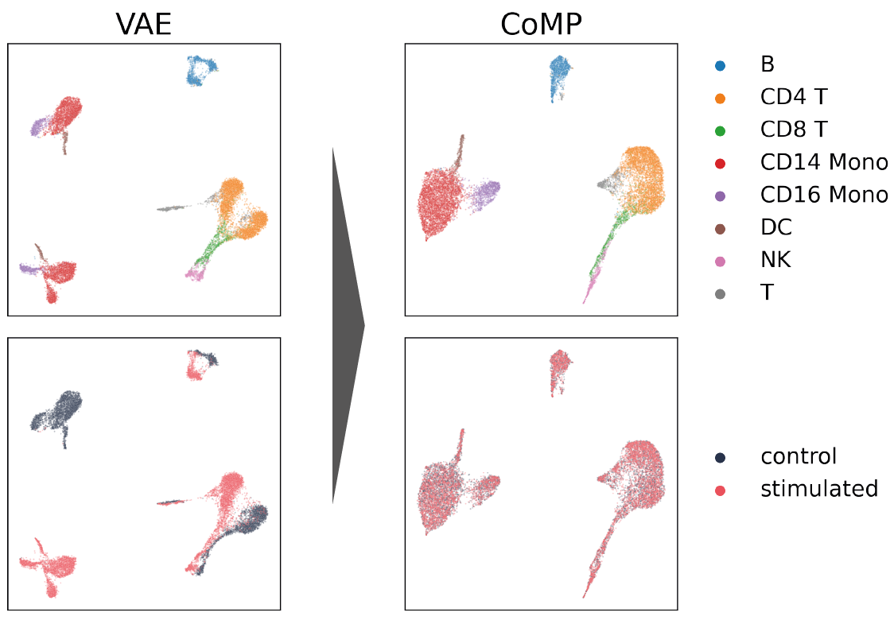

# Contrastive Mixture of Posteriors (CoMP) for Counterfactual Inference, Data Integration and Fairness

This is the PyTorch implementation of [Contrastive Mixture of Posteriors for Counterfactual Inference, Data Integration and Fairness](https://arxiv.org/abs/2106.08161) ICML 2022.



## Requirements

### System requirements

The following environment was used for the experiments, based on the `nvidia/cuda:11.0.3-cudnn8-devel-ubuntu20.04` docker image from [dockerhub](https://hub.docker.com/layers/nvidia/cuda/11.3.0-cudnn8-devel-ubuntu20.04/images/sha256-18beedacea7525d333a8c9e7419d42f26e6e84f8461fbf421da6c40243700d3a?context=explore):
* Ubuntu 20.04
* CUDA 11.0.3, cudnn 8
* Python 3.8


### Python environment
Running in a virtualenv or container is recommended. To install requirements:

```setup
pip install -U pip wheel
pip install -r requirements.txt
```


## Datasets
The model expects two files -- a data file named `features.tsv` and a file with labels named `metadata.tsv`, with sample indices as the first column in both files, and with headers as the first row. We set the conditional variable $c$ to have column name `"type"` in the metadata file.

The data is prepared in two steps.

### Step 1: Download source datasets
First the source datasets need to be downloaded from the following sources and placed into a folder `<data-dir>`.

#### Tumour / Cell Line Dataset
There are four files to download and prepare, as follows:
1. **Metadata file**: The Celligner_info.csv file is taken from  [here](https://figshare.com/articles/dataset/Celligner_data/11965269). Save the file as `<data-dir>/Celligner_info.csv`.
2. **HGNC gene names**: The file hgnc\_complete\_set_7.24.2018.txt can be downloaded from [here](https://figshare.com/articles/dataset/Celligner_data/11965269). Save the file as `<data-dir>/hgnc_complete_set_7.24.2018.txt`.
3. **Tumour gene expression data**: The TPM expression values can be downloaded from [here](https://xenabrowser.net/datapages/?dataset=TumorCompendium_v10_PolyA_hugo_log2tpm_58581genes_2019-07-25.tsv&host=https%3A%2F%2Fxena.treehouse.gi.ucsc.edu%3A443). Rename this file to `<data-dir>/TCGA_mat.tsv`.
4. **Cell Line gene expression data**: The data is downloaded from DepMap Public 19Q4 file: CCLE\_expression_full.csv [here](https://figshare.com/articles/dataset/DepMap_19Q4_Public/11384241). Rename this file to `<data-dir>/CCLE_mat.csv`.

#### Single cell PBMCs

Data was downloaded from the [theislab/trVAE_reproducibility](https://github.com/theislab/trVAE_reproducibility) repository. Download `kang_count.h5ad` from the Google Drive link in the _Getting Started_ section of the README to `<data-dir>/kang_count.h5ad`.

#### UCI Adult Income

Data was downloaded from the UCI Machine Learning [Repository](https://archive.ics.uci.edu/ml/datasets/adult). Download all `adult.{data,names,test}` files from the [data directory](https://archive.ics.uci.edu/ml/machine-learning-databases/adult/) to the `<data-dir>` directory.


### Step 2: Process data 
Next we process the data prior to training the model. Specify a separate output folder `<processed-data-x>` for each of the datasets and run the following:

```
# Tumour / Cell line data
python3 data/process_celligner_data.py --input-dir <data-dir> --output-dir <processed-data-tcl> --top-var-number 8000

# Kang et al. PBMC scRNA-seq under INFb stimulation
python3 data/process_kang.py --input-dir <data-dir> --output-dir <processed-data-kang> --top-var-number 2000

# UCI Income data
python3 data/process_uci_income.py --input-dir <data-dir> --output-dir <processed-data-uci>
```


## Training

Evaluation metrics are computed at the end of the training loop for the best checkpoint (by validation loss).
In all the commands below the `<processed-data>` below should be the path the directory containing the files listed in the previous section. `<output-dir>` should be the desired directory in which to save the outputs. It will be created if it does not exist.

To run the code using only the CPU, omit the `--use-cuda` flag in the arguments to the run script.


### Tumor / cell-line
```sh
python3 run.py --data-dir <processed-data-tcl> --output-dir <output-dir> --dataset tumour_cl --model comp --hidden-dim 512 --latent-dim 16 --num-layers 3 --use-batchnorm 1 --batch-size 5500 --num-epochs 4000 --learning-rate 0.0001 --penalty-scale 0.5 --kl-beta 1e-07 --seed 80244971  --use-cuda
```

### Single cell PBMCs
```sh
python3 run.py --data-dir <processed-data-kang> --output-dir <output-dir> --dataset kang --model comp --hidden-dim 512 --latent-dim 40 --num-layers 3 --use-batchnorm 1 --batch-size 512 --num-epochs 10000 --learning-rate 1e-06 --penalty-scale 1.0 --kl-beta 1e-07 --seed 196117 --use-cuda
```

### UCI Adult Income
```sh
python3 run.py --data-dir <processed-data-uci> --output-dir <output-dir> --dataset uci-income --model comp  --hidden-dim 64 --latent-dim 16 --num-layers 2 --use-batchnorm 1 --batch-size 4096 --num-epochs 10000 --learning-rate 0.0001 --kl-beta 1.0 --penalty-scale 0.5 --seed 116983357 --use-cuda
```

## Evaluation
An example notebook to evaluate the summary metrics is given in `evaluation.ipynb`.


## Results

Our model achieves the following performance on :

### Tumour / Cell Line Dataset

| Model | silhouette | kbet | mean-silhouette | mean-kbet |
|-------|------------|------|-----------------|-----------|
| VAE | 0.658|  0.974| 0.803| 0.581|
| CVAE | 0.554| 0.931| 0.684| 0.571|
| VFAE | 0.168| 0.258| 0.198| 0.188|
| trVAE  | 0.096|  0.163| 0.138| 0.123|
| Celligner | 0.082| 0.525| 0.568| 0.226|
| CoMP (ours) | 0.023| 0.160| 0.094| 0.101|

### UCI Adult Income

| Model | Gender Acc. | Income Acc. | silhouette | kbet |
|-------|-------------|-------------|------------|------|
| Original data | 0.796 | 0.849 | 0.067 | 0.786|
| VAE | 0.764 | 0.812 | 0.054 | 0.748 |
| CVAE | 0.778 | 0.819 | 0.054 | 0.724 |
| VFAE-sampled | 0.680 | 0.815 | - | -|
| VFAE-mean | 0.789 | 0.805 | 0.046 | 0.571 |
| trVAE | 0.698 | 0.808 | 0.066 | 0.731 |
| CoMP (ours) | 0.679 | 0.805 | 0.011 | 0.451 |

## Reference
If you find this code useful, do cite the following paper in your publication:

```
@inproceedings{foster2022contrastive,
  title={Contrastive Mixture of Posteriors for Counterfactual Inference, Data Integration and Fairness},
  author={Foster, Adam and Vez{\'e}r, {\'A}rpi and Glastonbury, Craig A and Creed, P{\'a}id{\'\i} and Abujudeh, Samer and Sim, Aaron},
  booktitle={International Conference on Machine Learning},
  pages={6578--6621},
  year={2022},
  organization={PMLR}
}
```